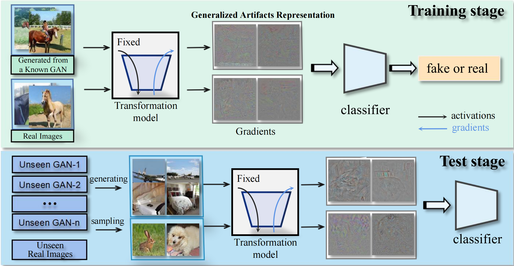

# Learning on Gradients

<p align="center">
    <br>
</p>



Reference GitHub repository for the paper: [Learning on Gradients: Generalized Artifacts Representation for GAN-Generated Images Detection](https://openaccess.thecvf.com/content/CVPR2023/papers/Tan_Learning_on_Gradients_Generalized_Artifacts_Representation_for_GAN-Generated_Images_Detection_CVPR_2023_paper.pdf). The paper is authored by Tan CC et al., published in IEEE/CVF CVPR 2023. If you use our code, please cite our paper:

```bibtex
@inproceedings{tan2023learning,
  title={Learning on Gradients: Generalized Artifacts Representation for GAN-Generated Images Detection},
  author={Tan, Chuangchuang and Zhao, Yao and Wei, Shikui and Gu, Guanghua and Wei, Yunchao},
  booktitle={Proceedings of the IEEE/CVF Conference on Computer Vision and Pattern Recognition},
  pages={12105--12114},
  year={2023}
}
```

## Environment Setup

We will set up two main environments: one for transforming images into gradients (`Img2grad` environment) and another for classification (`Classification` environment).

### Img2grad Environment

First, we recommend using the NVIDIA Docker image `nvcr.io/nvidia/tensorflow:21.02-tf1-py3` as the environment. This image will allow us to transform images into gradients using the TensorFlow environment.

#### Steps to Install:
1. Ensure you have [Docker](https://docs.docker.com/get-docker/) installed, and download the image from NVIDIA's [NGC Catalog](https://catalog.ngc.nvidia.com/orgs/nvidia/containers/tensorflow/tags).
2. Pull the image using the following command:
    
    ```bash
    docker pull nvcr.io/nvidia/tensorflow:21.02-tf1-py3
    ```

### Classification Environment

The classification environment depends on several Python packages. We recommend installing the required dependencies by running:

```sh
pip install -r requirements.txt
```

This command will install all dependencies listed in the `requirements.txt` file. Make sure to run it within a virtual environment to avoid affecting the global environment.

## Getting the Data

To start training and testing the model, we need to download the appropriate dataset. You can download the related dataset from the [CNNDetection](https://github.com/peterwang512/CNNDetection) project.

#### Steps to Download:
1. Go to the CNNDetection GitHub repository and download the required dataset.
2. After downloading, place the dataset in the specified directory in the project.

## Transform Image to Gradients

In this section, we will describe how to transform images into gradients, a critical step in detecting GAN-generated images in this project.

### 1. Download StyleGAN Pretrained Model

First, download the pretrained [StyleGAN](https://github.com/NVlabs/stylegan) model and place it in the following directory:

```bash
<project_dir>/img2grad/stylegan/networks/
```

You can download it manually or automatically using the following command:

```bash
mkdir -p ./img2grad/stylegan/networks
wget https://lid-1302259812.cos.ap-nanjing.myqcloud.com/tmp/karras2019stylegan-bedrooms-256x256.pkl -O ./img2grad/stylegan/networks/karras2019stylegan-bedrooms-256x256.pkl
```

### 2. Transform Images to Gradients

Use the following command to transform the images in the specified dataset into gradients and save the gradient files in the target directory:

```bash
sh ./transform_img2grad.sh {GPU-ID} {Data-Root-Dir} {Grad-Save-Dir}
```

- `{GPU-ID}`: The ID of the GPU to be used.
- `{Data-Root-Dir}`: The root directory containing the original images.
- `{Grad-Save-Dir}`: The target directory to save the transformed gradient files.

This step is crucial as it uses the pretrained model to capture artifact information from images, representing them as gradient data for subsequent detection tasks.

## Training the Model

Once the data preparation and image-to-gradient transformation are complete, you can begin training the detector. Run the following command to train the model:

```bash
sh ./train-detector.sh {GPU-ID} {Grad-Save-Dir}
```

Where:
- `{GPU-ID}`: The ID of the GPU to be used.
- `{Grad-Save-Dir}`: The directory containing the saved gradient files.

During training, the model will use the transformed gradient data to learn, improving its ability to detect artifacts in GAN-generated images.

## Testing the Detector

To test the trained detector, download the pretrained weight files. You can get them from this link: [Download Pretrained Weights](https://drive.google.com/drive/folders/17-MAyCpMqyn4b_DFP2LekrmIgRovwoix?usp=share_link).

Once downloaded, run the following command to perform the testing:

```bash
cd CNNDetection
CUDA_VISIBLE_DEVICES=0 python eval_test8gan.py --model_path {Model-Path} --dataroot {Grad-Test-Path} --batch_size {BS}
```

- `{Model-Path}`: The path to the model weights.
- `{Grad-Test-Path}`: The path to the test data (in gradient representation).
- `{BS}`: The batch size.

During the testing phase, the model will evaluate new gradient data to verify its performance in detecting GAN-generated images.

## Acknowledgments

This repository partially borrows code and resources from the following open-source projects:

- [CNNDetection](https://github.com/peterwang512/CNNDetection)
- [stylegan](https://github.com/NVlabs/stylegan)
- [genforce](https://github.com/genforce/genforce/)

